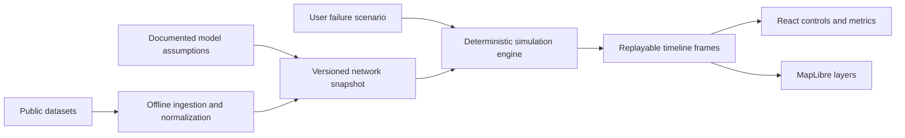
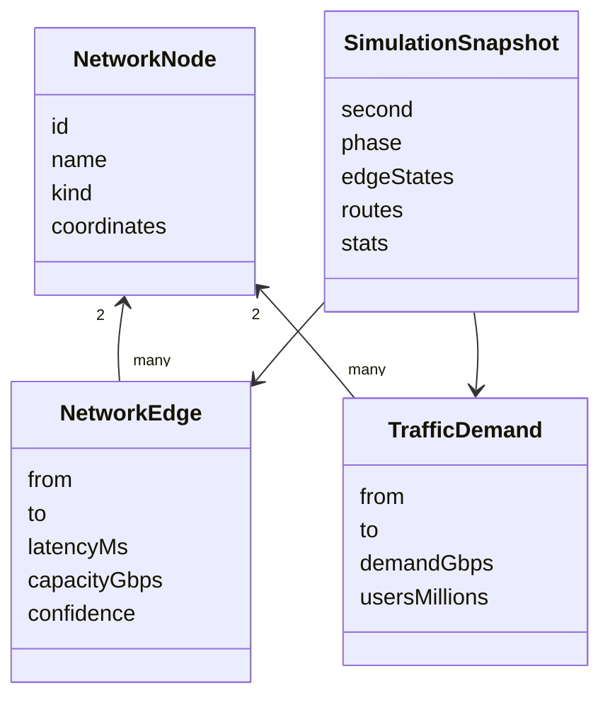

# Architecture

This document describes the current vertical slice and the intended path from a small educational model to a larger, evidence-backed simulator.

## Design principles

1. **Explainable before exhaustive.** A user should be able to understand why a route changed.
2. **Deterministic by default.** Identical inputs produce identical frames, making tests and shared scenarios reliable.
3. **Keep facts separate from assumptions.** Geometry, capacity, demand, and inferred links carry confidence metadata.
4. **Keep the engine independent from the map.** Simulation code accepts plain typed data and knows nothing about React or MapLibre.
5. **Do not imitate BGP with plain geographic shortest paths.** The current algorithm is explicitly simplified; policy belongs in a later routing layer.
6. **Prefer immutable dataset snapshots.** A scenario should be reproducible against a named input version.

## System context



The current repository starts at `Versioned network snapshot`: `web/lib/demo-network.ts` is a hand-audited fixture standing in for the future ingestion pipeline.

## Runtime boundaries

### Presentation

`web/components/Simulator.tsx`

- Owns scenario playback state.
- Starts, pauses, resets, and scrubs the timeline.
- Formats user-facing metrics and event explanations.
- Does not calculate routes.

`web/components/NetworkMap.tsx`

- Translates nodes and edge states into GeoJSON.
- Owns the MapLibre instance and layer visibility.
- Renders state through colors and route inspection popups.
- Does not decide whether an edge is congested or failed.

### Domain model

`web/lib/model.ts`

- Defines nodes, edges, traffic demand, route results, edge state, metrics, and snapshots.
- Contains no framework dependencies.
- Provides the contract shared by ingestion, simulation, tests, and presentation.

### Input snapshot

`web/lib/demo-network.ts`

- Contains the small Asia-Pacific graph used by the first scenario.
- Labels each edge as `observed`, `inferred`, or `synthetic`.
- Keeps traffic demand and population assumptions outside UI code.

### Simulation

`web/lib/simulation.ts`

- Allocates baseline demand.
- Removes failed edges.
- Recomputes routes with a deterministic Dijkstra implementation.
- Applies a nonlinear congestion penalty to heavily utilized edges.
- Produces final edge states and summary metrics.
- Generates six named frames covering 0–30 seconds of model time.

## Data model



## Routing algorithm

For each demand, the engine evaluates available graph edges with this illustrative cost:

```text
edge cost = modeled latency × congestion penalty

congestion penalty = 1 + max(0, utilization - 0.5)² × 5
```

Demands are allocated from largest to smallest. This makes results deterministic but introduces an ordering assumption. It is adequate for the vertical slice, not for research conclusions.

### Current limitations

- Undirected links; real routing is directional.
- A single path per demand; no ECMP or flow splitting.
- Synthetic capacity and traffic demand.
- No autonomous-system business relationships or BGP attributes.
- No route convergence protocol; timeline phases are explanatory model time.
- No confidence intervals.

### Planned engine evolution

1. Compute k-shortest and edge-disjoint alternatives.
2. Allocate traffic through min-cost multi-commodity flow approximations.
3. Run the engine in a Web Worker.
4. Introduce provider/customer/peer constraints for AS-level scenarios.
5. Return uncertainty ranges instead of single estimates.

## Data ingestion architecture

The future offline pipeline should:

1. Download an immutable raw snapshot.
2. Verify checksum and record licensing metadata.
3. Normalize provider schemas into the domain model.
4. Resolve facilities, metros, landing stations, and cloud regions.
5. Infer missing links separately from observed links.
6. Validate graph connectivity and coordinate bounds.
7. Produce a compact, versioned web artifact.

Python is appropriate for that offline work because GeoPandas and related GIS tools are mature. It should live outside the web runtime with its own locked environment. Conda is optional and may be useful for GDAL; it is not needed for the current application.

## Deployment

The web application uses the standard Next.js App Router and can be deployed directly to Vercel. It has no database, authentication, uploads, or server-owned state. Map controls and simulation state are device-local and ephemeral.

## Testing strategy

- **Unit tests:** determinism, edge removal, rerouting, metric direction, and timeline bounds.
- **Fixture tests:** known scenarios checked against reviewed summaries.
- **Integration tests:** map state reflects a returned simulation snapshot.
- **Data validation:** unique IDs, valid endpoints, nonnegative capacity, and coordinate bounds.

The first slice includes unit tests. Browser automation and dataset validators should arrive with user-selected failures and external data.
